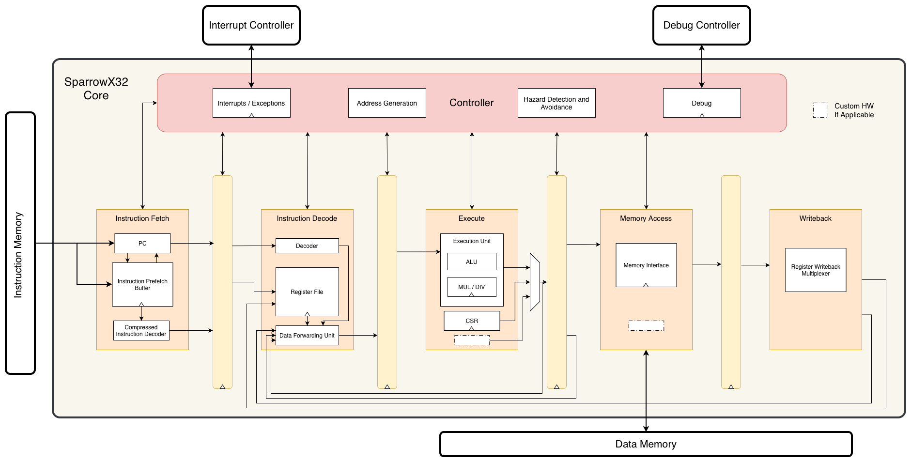

# SparrowX32

This is the public repository version of SparrowX32.

SparrowX32 is a 32-bit RISC-V CPU core written primarily in VHDL. It is designed to simplify the integration of custom hardware modules for a wide range of applications. The modular pipeline architecture allows users to extend the core by adding their own hardware components, enabling flexible feature expansion.

A reference design implementation of a microcontroller soc using the SparrowX32 core is provided: [pearl3](https://github.com/Rudran97/pearl3_pub.git).

Also refer to ___ for software and library support for the reference design implementation.

## Block Diagram

## Design Features

The following features are supported or implemented:

* Five stage in-order pipeline.

* Support for RISC-V standard extensions such as Integer (I) or Embedded (E), Integer Multiplication and Division (M), and Compressed (C) extensions. These extensions can be enabled or disabled in the [options_pkg.vhd](rtl/options_pkg.vhd) file.

* Support for Machine (M) privilege mode.

* Control and Status Register (CSR) operations. See [CSR.md](docs/CSR.md) for more details on the supported machine-level CSRs.

* Hardware support for fast interrupt context switching. See [fast_interrupt.md](docs/fast_interrupt.md) for implementation details.

* Debugger support. See [debugger.md](docs/debugger.md) for more details on debugger implementation.

## Repository Structure

$REPO_TOP refers to the project root. All paths below are relative to this location.

* $REPO_TOP/rtl - Contains all the rtl files related to the core. The file `svx32_core.vhd` declares the top-level module `svx32_core`.

* $REPO_TOP/test/sw - Contains simple software programs for testing and simulation.

* $REPO_TOP/test/tb - Contains the testbenches for simulating the svx32_core top-level module.

* $REPO_TOP/test/makehex.py - A simple python script that converts .hex files generated by the RISC-V toolchain to ROM initializtion files for simulation.

* $REPO_TOP/Makefile - Builds both RTL design and example software located in ./test/sw/Sw.S.

## Quick Setup

The the following tools are recommended by not strictly required (depending on your workflow):

* Python3 to convert .hex file to rom init file to run test softwares.
* GHDL for static analysis and syntax checking. It is also used to convert the top-level VHDL code to Verilog for formal verification.
* RISC-V 32-bit toolchain preferably with imc_zicsr extension for compiling software targeting the core.
* FPGA synthesis tools such as Xilix Vivado or Intel Quartus prime.
* Simulation tools such as QuestaSim or ModelSim.